# 无人机控制台整体逻辑流程图

## 系统架构图

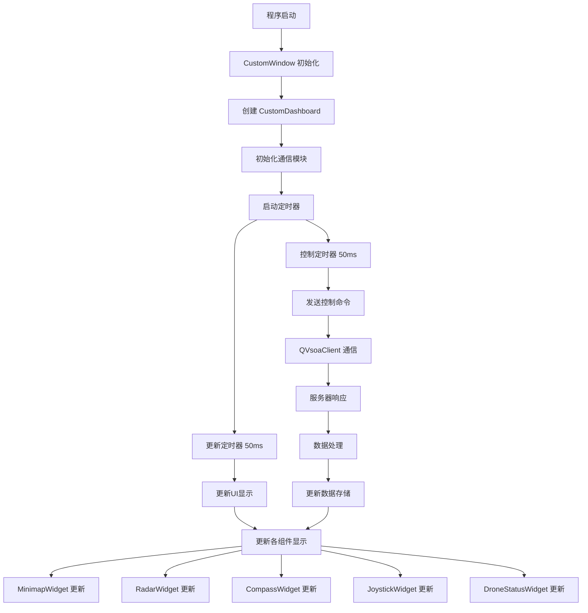

## 详细数据流图

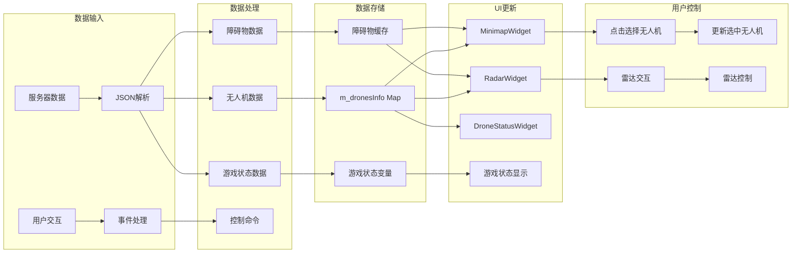

## 组件交互图

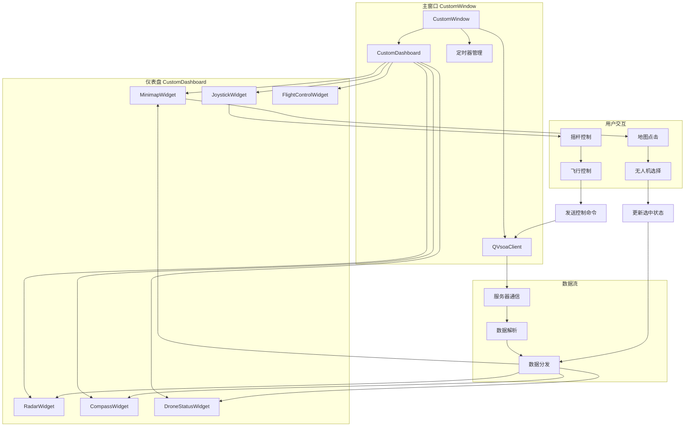

## 通信流程图

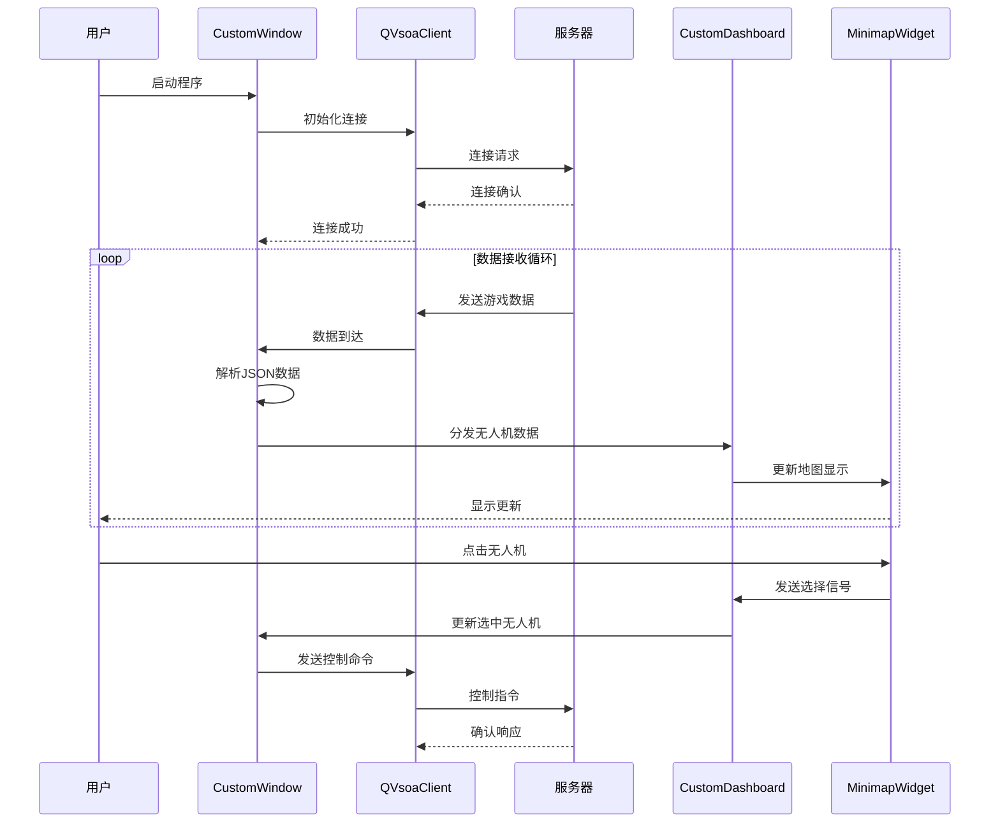

## 障碍物管理流程图

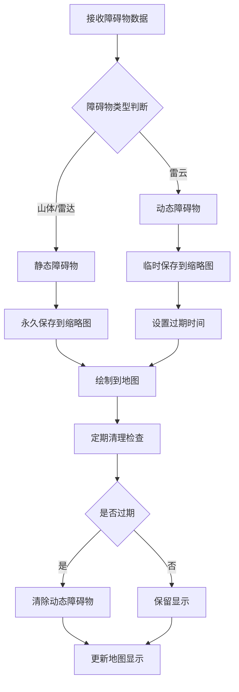

## 无人机选择流程图

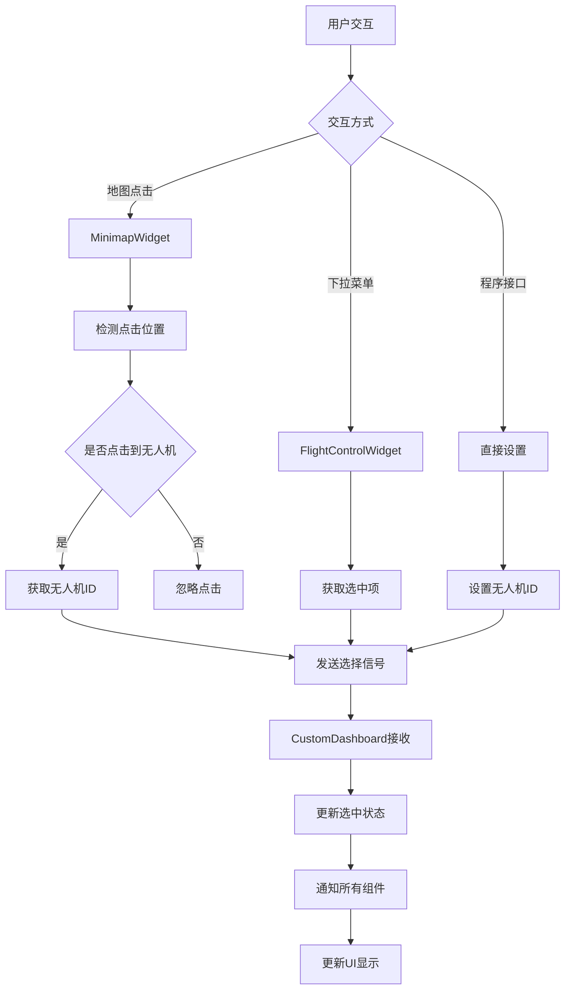

## 控制命令流程图

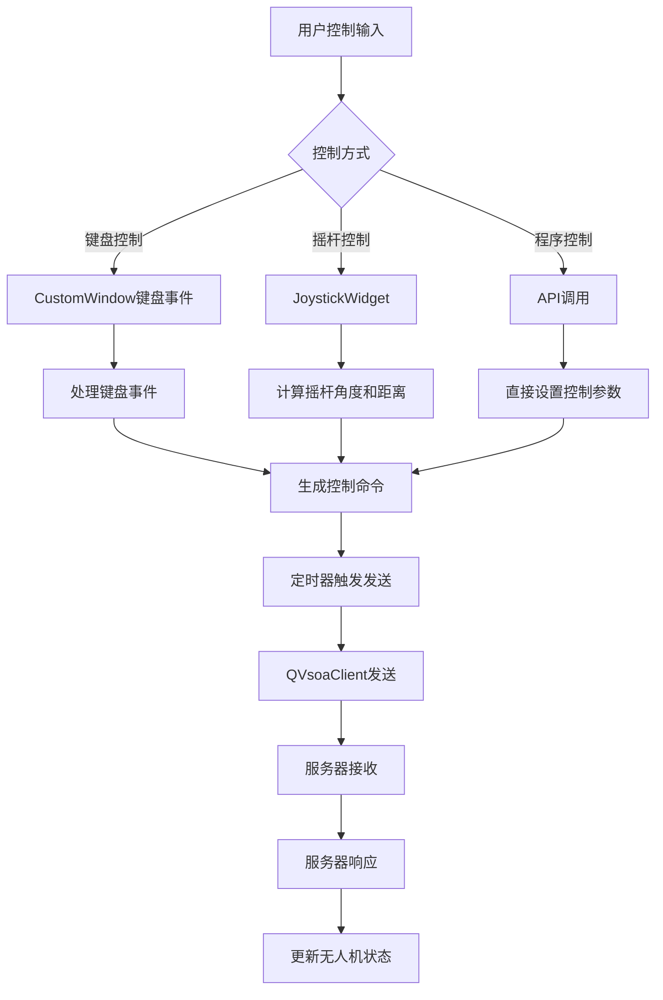

## 数据更新时序图

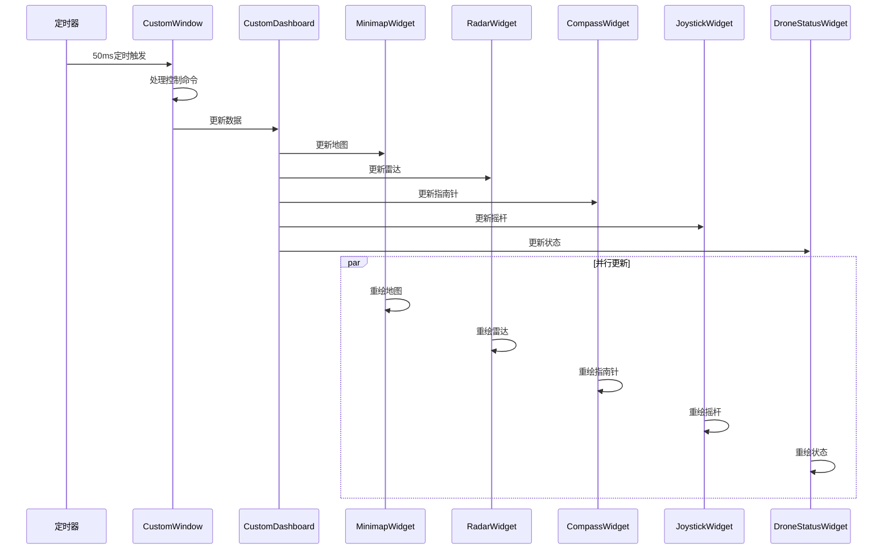

## 错误处理流程图

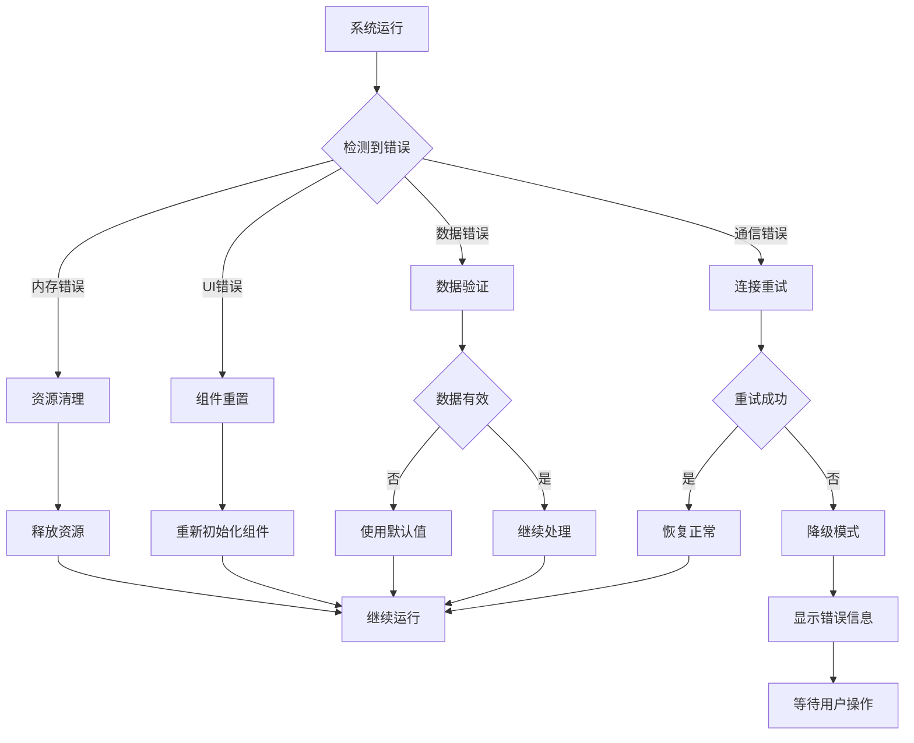

## 系统状态转换图

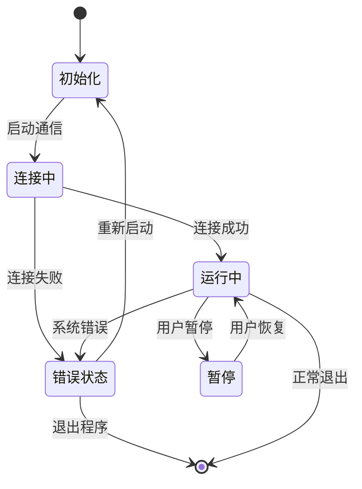

## 性能监控图

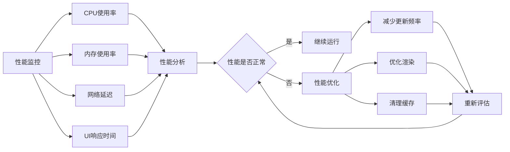

---

## 关键参数说明

### 定时器配置

- **控制定时器**: 50ms (20Hz)
- **更新定时器**: 50ms (20Hz)
- **雷达扫描**: 实时动画
- **障碍物清理**: 1 秒超时

### 地图配置

- **地图尺寸**: 1280x800 像素
- **缩放范围**: 0.3x - 2.0x
- **探测半径**: 300 像素
- **网格间距**: 50 像素

### 通信配置

- **协议**: QVsoa
- **数据格式**: JSON
- **重连机制**: 自动重连
- **超时设置**: 可配置

### 内存管理

- **基础内存**: ~50MB
- **动态增长**: 线性增长
- **缓存清理**: 自动清理
- **资源释放**: 程序退出时

---

_流程图版本: 1.0_  
_最后更新: 2024 年_
